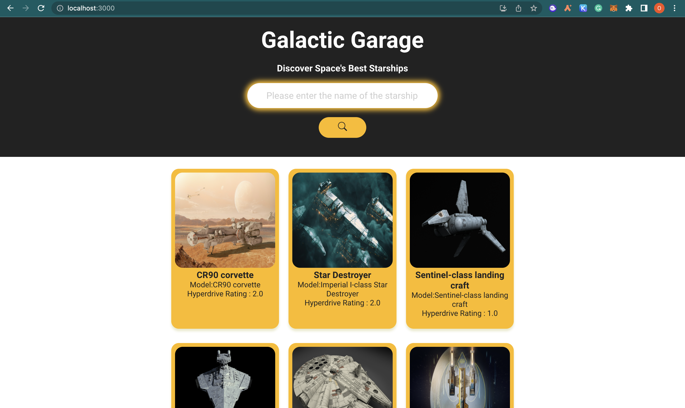
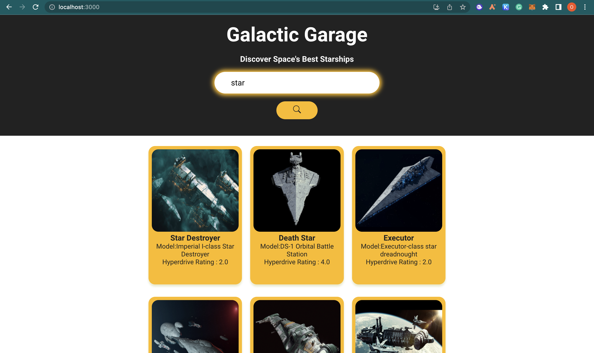
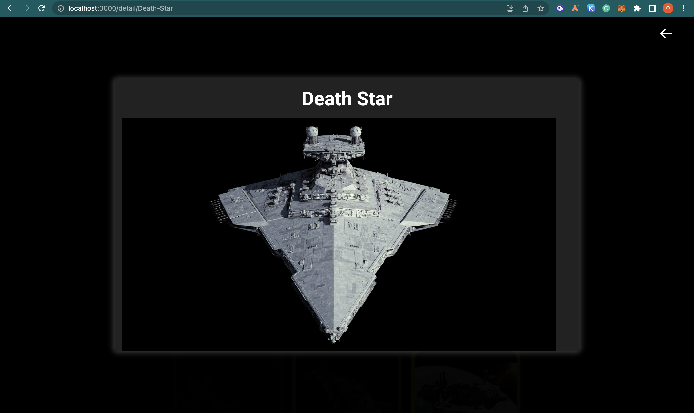
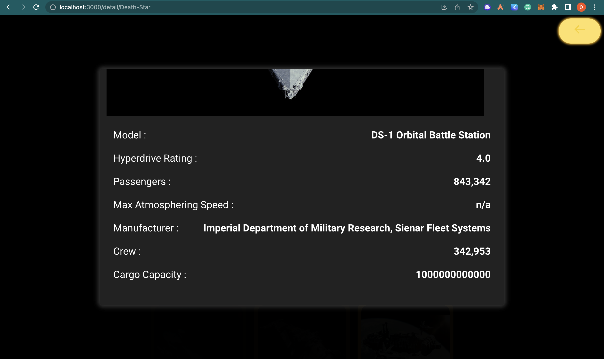
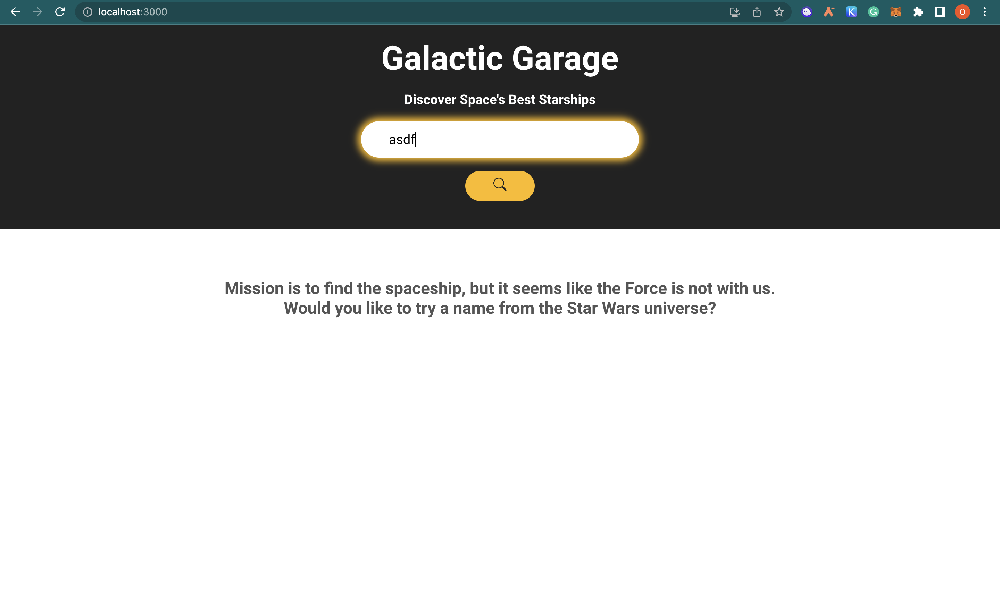

# Galactic Garage

Bu uygulama, Star Wars evrenindeki araçları aramak ve özelliklerini görüntülemek için [SWAPI](https://swapi.dev)'yi kullanır. Uygulama, API'den alınan verileri kullanarak araçların adını, modelini ve diğer özelliklerini gösterir.

## Özellikler ve Ekran Görüntüleri






-Site ilk açıldığında, en popüler uzay gemilerinin resimleri listelenir.Load more butonunu kullanarak daha fazla uzay gemisi yükleyebilirsiniz.
-Sayfanın üst kısmında bir arama kutusu yer alır, buradan uzay gemilerini isimlerine veya modellerine göre arayabilirsiniz.
-Uzay gemisi kartlarının üzerine tıklayarak, ilgili uzay gemisinin detay sayfasına ulaşabilirsiniz.
-Detay sayfasından geri tuşuna basarak bir önceki sayfaya dönebilirsiniz.
-Eğer aradığınız uzay gemisi site içinde bulunmuyorsa, uyarı mesajı ile karşılaşırsınız.

## Bilgisayarınızda Çalıştırın

Projeyi klonlayın

```bash
  git clone https://github.com/ozlemezgi/galactic_garage.git
```

Proje dizinine gidin

```bash
  cd galactic_garage
```

Gerekli paketleri yükleyin

```bash
  npm install
```
```bash
  npm install axios
```
```bash
  npm install react-router-dom@6
```
```bash
  npm install react-icons
```

Sunucuyu çalıştırın

```bash
  npm start
```
Uygulama http://localhost:3000 adresinde çalışacak şekilde başlatılacaktır.

  
## Geri Bildirim

Herhangi bir geri bildiriminiz varsa, lütfen ozlemezgisari@icloud.com adresinden bana ulaşın.

  
